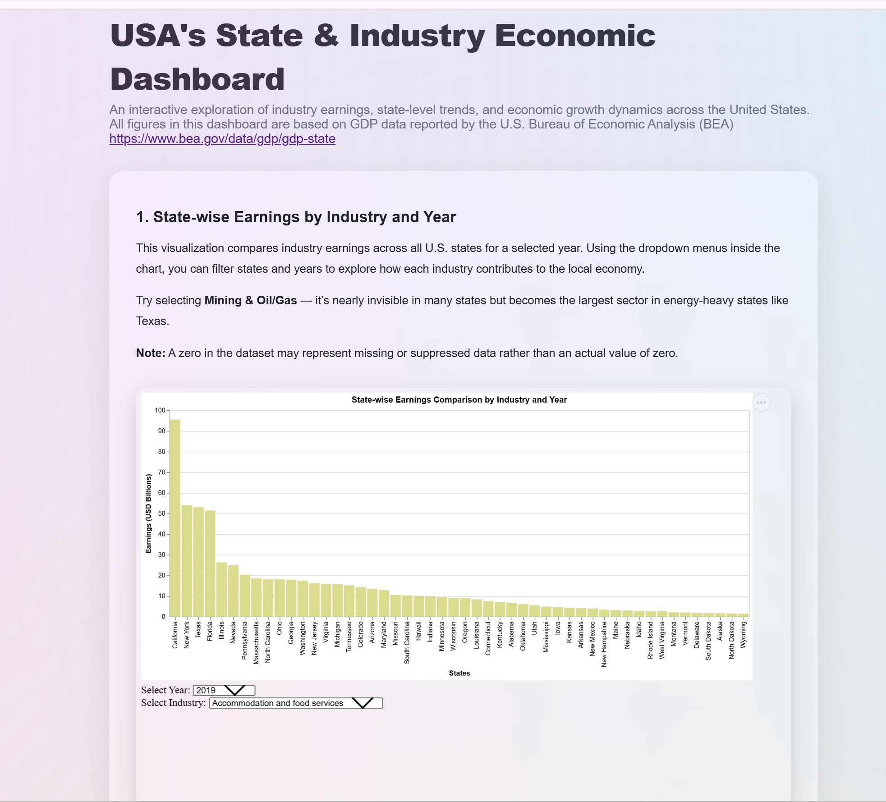
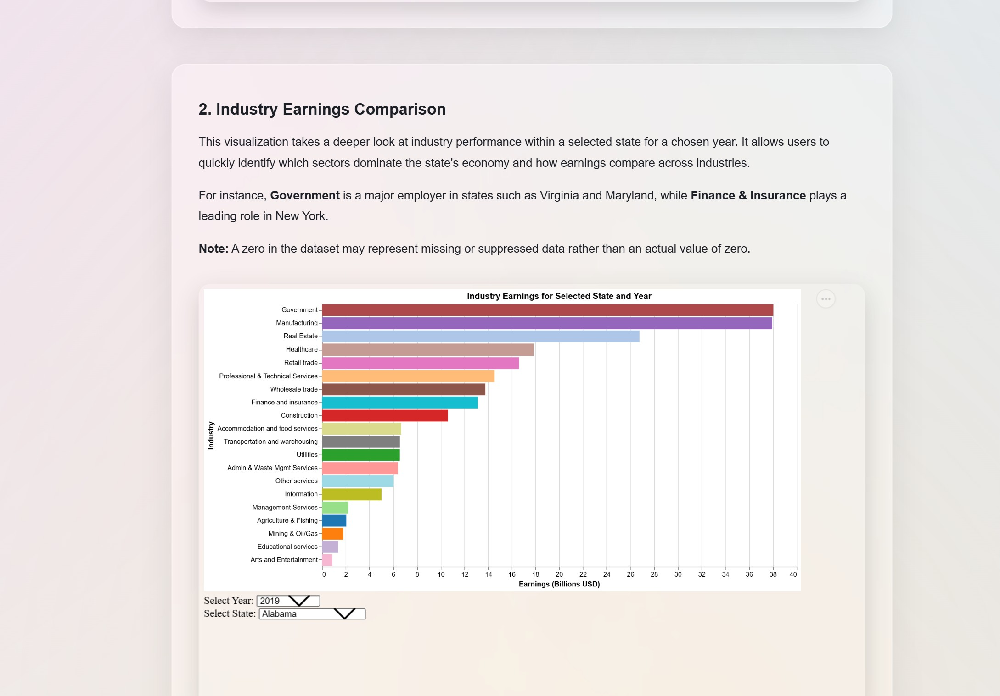
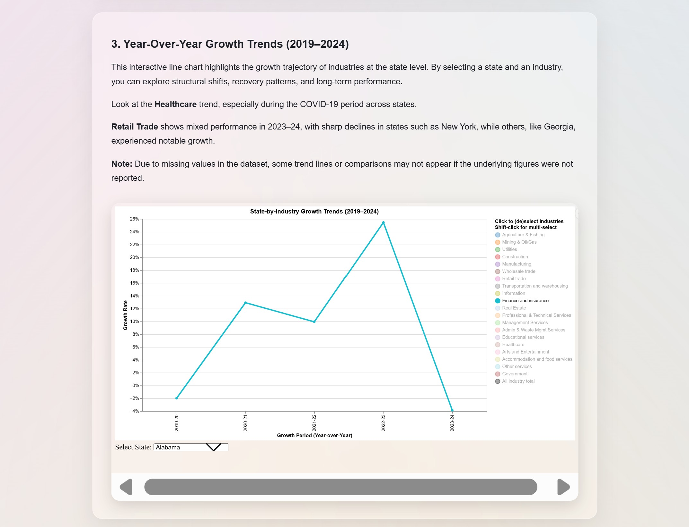

# USA's State & Industry Economic Dashboard

Shumaila Abbasi 

## Description

This project presents an interactive dashboard that visualizes U.S. state-level industry earnings and growth trends using GDP data from the Bureau of Economic Analysis (BEA). Users can explore how different industries contribute to each state’s economy and examine year-over-year growth patterns from 2019 to 2024.

Link 

https://shumaila9467.github.io/statewise-economy/ 

## Data Sources

BEA Webpage
https://www.bea.gov/data/gdp/gdp-state