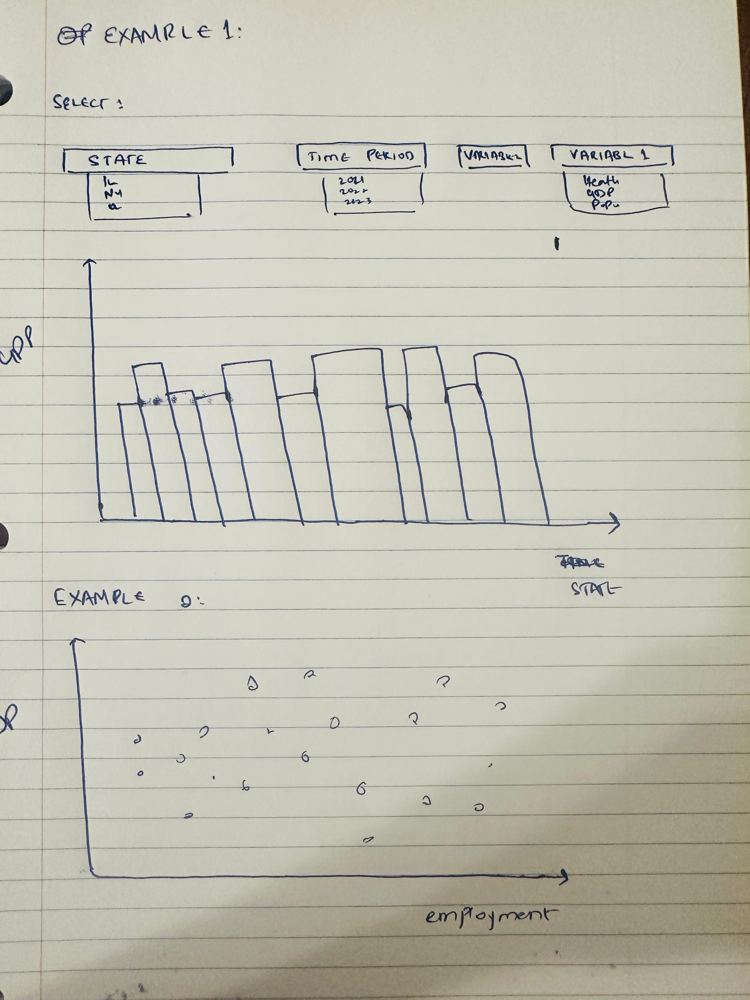

# Shumaila Abbasi 

## Description
This project explores the relationship between state-level economic structure and socioeconomic well-being in the United States between 1997 and 2023 (subject to change based on meaningful relations) 
By combining data from the Bureau of Economic Analysis (BEA) and the U.S. Department of Agriculture’s Economic Research Service (ERS), users will be able to examine how indicators such as education attainment, unemployment, and population interact with GDP and industry output across states.
The project aims to answer questions like:
- How does GDP growth relate socioeconomic variables such as population, education, employment?
- Have states diversified their economies in ways that improve socioeconomic outcomes?
The user interface will allow exploring both temporal trends and cross-sectional relationships between economic and social variables.
## Technical Plan : Option B (Dynamic Ensemble)
I will pursue Option B: Dynamic Ensemble, since it supports multiple linked interactive charts, enabling users to explore both trends and relationships between variables without requiring a map.s
### Why this option
Option B provides flexibility to build a dashboard with line charts, bar charts, and scatter plots, all interacting through shared controls. This is ideal for comparing state-level patterns and visualizing associations between economic and social data.
### Libraries / Tools
- **Altair / Vega-Lite** – interactive charts with dropdowns and sliders  
- **HTML + CSS** – structure and design for final dashboard  
### Types of Charts I am considering 
1. Line Chart – Economic Trend Over Time* 
   Shows selected economic indicator (e.g., GDP in a chosen industry) for states, 1997–2023.  
2. Bar Chart – Rankings by Year 
   Displays the top 10 states for the selected economic indicator in a given year.  
3. Scatter Plot – Economic vs. Social Relationship
   Allows users to choose any two variables to explore relationships.  
   Example: GDP growth rate vs. unemployment rate,  
Together, these views allow users to connect economic growth patterns with demographic and social outcomes.
## Mockup

 

The above image shows 3 drop down options: STATE, TIME PERIOD, VARIABL 1 and VARIABLE 2
if the user wants to see GDP for all states for the year 2024, it will get Example 1 from the sketch 
If the user wants to observe relationship through scatter plot between Employment and GDP, Example 2 will be the preview

## Inspiration 
Slider Idea: 
https://ourworldindata.org/co2-gdp-decoupling 
The scatterplot idea is similar to link below
https://pip.worldbank.org/key-inequality-indicators 
## Data Sources
1. Bureau of Economic Analysis (BEA) — Gross Domestic Product by State and Industry
Main Website: https://apps.bea.gov/itable/?ReqID=70&step=1
Example Dataset: BEA Interactive Table Example
Description:
This dataset provides annual Gross Domestic Product (GDP) for all 50 U.S. states, broken down by major NAICS industry categories. The time series extends approximately from 1997 to 2024, depending on data availability for each sector.
Each observation includes GDP (in millions of dollars) for a specific state, year, and industry. The dataset enables comparison of economic performance and structural changes across states.
Derived variables to be used include:
•	GDP growth rate (%) – year-over-year percentage change in real GDP
•	Industry share of total state GDP (%)

2. U.S. Department of Agriculture — Economic Research Service (ERS) State-Level Socioeconomic Indicators
Main Website: https://ers.usda.gov/
Variables I intend to Use
•	Education: https://data.ers.usda.gov/reports.aspx?ID=4026
•	Unemployment: https://data.ers.usda.gov/reports.aspx?ID=4038
•	Population: https://data.ers.usda.gov/reports.aspx?ID=4049
Description:
The ERS data provide key state-level socioeconomic indicators such as education attainment, unemployment rates, and population estimates. These datasets cover all 50 states, with a minimum of five years of data for each variable (the exact period varies by indicator).
## Questions
1.	Is it okay if I create a customized excel file with all the desired variables and work on that for this project?
2.	If in case some scatter charts don’t show meaningful relationships, will the project be penalized?

